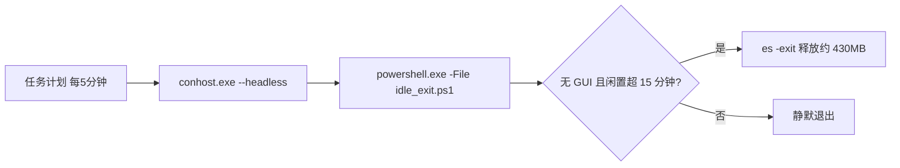

# Plan: sh-everything-search 闲置退出任务无窗口化（conhost --headless 注册 + 脚本化）

Plan for: "修复计划任务 sh-everything-idle-exit 每 5 分钟闪窗；注册方式改为 conhost --headless 并脚本化入库；修正技能收敛移动后的路径失效；同步更新技能文档"

## 问题陈述

计划任务 `sh-everything-idle-exit` 每 5 分钟触发时，用户的 Windows Terminal 主窗口（taskmon）会**新开并激活一个空白 PowerShell 标签页**（约 1.5 秒后关闭）——即用户长期看到的"弹终端"；禁用任务即消失。根因（2026-10-10 屏幕录制实证）：`powershell.exe` 为控制台子系统程序，任务计划服务以无控制台方式拉起它时触发 Windows 11 **控制台委托（handoff）**——本机 `HKCU\Console\%%Startup` 为「让 Windows 决定」，系统选择正在运行的 Windows Terminal 承接控制台；WT 配置 `windowingBehavior=useExisting`，于是标签页开在**已有窗口内**（标签标题即 powershell 命令行），命令结束自动关闭。该现象不产生任何顶层窗口事件（WinEvent 钩子全程零可见窗口），也不受 `-WindowStyle Hidden` 与任务"隐藏"属性影响。

另发现：技能近日被 db9983c 收敛移动至 `sh-user-skills/sh-everything-search/` 后，任务动作引用的旧脚本路径已失效（Test-Path=False），README 包装器示例路径同样过期，需一并修正。

## 需求（含用户决策）

1. **修复方式＝`conhost.exe --headless` 包装**（用户选 1=a）：由显式 headless 控制台宿主运行任务命令，绕开控制台委托，从"创建即不产生可委托控制台"层面根除闪窗；进程仍留在用户交互会话，`idle_exit.ps1` 依赖的「Everything GUI 窗口检测（MainWindowHandle）」与「es IPC 退出用户会话实例」语义不变。
   - 否决项：S4U（session 0 看不见用户桌面窗口、够不到用户会话 Everything IPC，语义破坏）；VBS 薄壳（微软弃用中，仅在 headless 无法绕过委托时兜底）。
2. **任务注册脚本化落库**（用户选 2=a）：新增 `scripts/register_task.ps1`，幂等，可重装/换机一键注册。
3. **收尾验证后恢复启用**（用户选 3=a）；**验收口径**：触发时刻"WT 标签页零翻转、画面零可见变化"（标题轮询/录屏为主，钩子窗口事件辅证——本次已证实标签页不会产生窗口事件）。
4. **文档与脚本同步更新**（用户追加要求："如果真的修复了，记得也更新一下那个 skill"）。

## 背景与调研

- 根因链（2026-10-10 实证修正）：任务触发 → 无控制台父进程创建 powershell 控制台 → **控制台委托到正在运行的 Windows Terminal**（决定项=「让 Windows 决定」；WT `windowingBehavior=useExisting`）→ WT 在现有窗口内**新开并激活空白 PowerShell 标签页**（存活约 1.5s，标题为命令行）→ 命令结束标签关闭。证据：ffmpeg 整屏录制在 `:53:52` 探针触发后捕捉到 WT 标签数 1→2→1、内容切黑再恢复；WinEvent 钩子全程零可见顶层窗口；3 次触发均伴随 conhost 侧 `PseudoConsoleWindow`（ConPTY 交接桩）创建。
- 检测器对照实验（2026-10-10）：40ms 轮询 WT 主窗口标题——旧式启动（`powershell -WindowStyle Hidden` 作为 powershell 自身参数）标题翻转 `taskmon → …powershell.exe → Windows PowerShell → taskmon`（=委托标签闪现，检测器有效）；`conhost.exe --headless` 启动标题零变化（不触发委托）；`Start-Process -WindowStyle Hidden`（STARTF SW_HIDE 于创建时生效）亦未见翻转。经典"conhost 先画窗、-WindowStyle Hidden 太晚"是另一类闪窗机制（非本例）。
- 任务现状（Export-ScheduledTask XML 实测，注册脚本需逐项复刻）：Trigger=TimeTrigger + Repetition `PT5M`（无 Duration，无限重复）；Settings=`Hidden=true / IgnoreNew / PT5M / StartWhenAvailable=true / DisallowStartIfOnBatteries=false / StopIfGoingOnBatteries=false / UseUnifiedSchedulingEngine=true`；Principal=Interactive / Limited；Description=`Exit Everything after 15 min idle (sh-everything-search skill)`。
- 路径现状：脚本真实位置 `…\skills\sh-user-skills\sh-everything-search\scripts\idle_exit.ps1`（Test-Path=True）。
- 旧路径引用全仓扫描：仅 `README.md` 一处需改（router 仅含技能名；`.archived`、`docs` 无引用）。
- 提交环境：子仓 origin=`git@github.com:shihao-hub/td-agents-skills.git`（main）；`core.hooksPath=.githooks`（pre-commit 为国内密钥扫描）。仓库存在其它会话在途未提交文件（`.gitleaks.toml`、`.githooks/`、`.tests/`、`README-SECURITY.md`、`plans-05-*.md`、`secret_scanner.py`、`.archived/sh-edu-infographic/*`），本任务一律不碰、不暂存。
- 编码坑（本次实测）：PS 5.1 读取无 BOM 的 .ps1 时按 ANSI 解析，中文注释会导致解析错误——技能内 .ps1 一律 ASCII + 英文注释（与既有脚本一致）。

## 方案设计

新任务动作（由注册脚本以绝对路径生成）：

```
Execute   : C:\Windows\System32\conhost.exe
Arguments : --headless "C:\Windows\System32\WindowsPowerShell\v1.0\powershell.exe" -NoProfile -ExecutionPolicy Bypass -File "<skill>\scripts\idle_exit.ps1"
```

- `$PSScriptRoot` 推导 `idle_exit.ps1` 路径 → 技能目录再移动只需重跑注册脚本；
- 去掉已无意义的 `-WindowStyle Hidden`（headless 下无窗口可藏，且对委托无抑制作用）；
- **风险与判据**：若 `conhost.exe --headless` 作为任务动作仍触发委托（WT 标题翻转/出现新标签页），判定方案失败——回退备选（VBS 薄壳 / 进一步抑制控制台创建）并报告重规划；验收以标题轮询+录屏为准。



- `register_task.ps1`：幂等（存在即先注销再注册）、默认注册为启用、支持 `-Unregister`；
- 验证器两个（均入库，回归检查用）：`verify_wt_tab_flash.ps1`（40ms 轮询 WT 主窗口标题，捕捉委托标签闪现；main 检测器）、`verify_task_window.ps1`（WinEvent 钩子窗口事件，辅证；含正对照开关）；
- README 更新：示例路径修正；生命周期节写注册脚本用法与委托/handoff 机制（警示勿再以 `powershell.exe` 直注册）；环境事实追加根因与验证方法（标题轮询/录屏为主、钩子辅证）。

## 任务分解

- [x] Task 1: 复现基线——临时探针任务 + 整屏录制/窗口事件钩子，钉死闪窗现象与观测口径
  - 文件：临时 `%TEMP%\opencode\win_event_watch.ps1`（不入库）；临时任务 `sh-everything-idle-exit-probe`（旧式动作，1 分钟无限重复，Interactive/Limited，Hidden）
  - 实现：写钩子验证器（后台消息泵 + 事件队列 + 逐秒落盘）；注册探针任务；并行 ffmpeg 整屏录制；结束后注销探针任务
  - 验证：录屏在触发时刻捕捉到 WT 新增空白 PowerShell 标签页（1→2→1）；钩子零可见窗口（证明标签页不产生窗口事件）；用户肉眼目击确认
  - Demo：录屏帧对比（新增标签页 → 恢复）与钩子日志
  - 实施说明（2026-10-10）：基线已复现并可视化——用户两次肉眼目击 + ffmpeg 在 `:53:52` 触发后捕捉到 WT 标签数 1→2→1、内容切黑（标签标题 `C:\Windows\System32\WindowsPow…`）；钩子实测仅 3 次 `PseudoConsoleWindow`（无可见窗口），故"窗口事件"不是本现象的观测口径，验收改用标题轮询/屏幕录制为主。探针任务已注销，根因修正为"控制台委托 → WT 新增/激活标签页"。

- [x] Task 2: 编写注册脚本并重注册真实任务
  - 文件：`sh-user-skills/sh-everything-search/scripts/register_task.ps1`（新增）
  - 实现：按"背景与调研"逐项复刻 Trigger/Settings/Principal/Description；动作改为 conhost --headless + 新路径；幂等 + `-Unregister` 开关；注册前先做定向预检（conhost --headless 单发是否产生新 WT 标签页）
  - 验证：注册后 XML 比对全部一致（动作/设置/触发器/身份）；`Test-Path` 动作引用路径=True；手动 Start-ScheduledTask 一次 → LastTaskResult=0；预检/手测期间确认无新标签页
  - Demo：幂等重跑演示；任务恢复 Enabled
  - 实施说明（2026-10-10）：预检因屏幕被全屏视频遮挡改为"WT 标题轮询对照实验"（详见背景）——headless 单发零翻转；注册后 XML 与原始配置逐项一致（仅动作/路径/StartBoundary 为目标变更；原 Enabled=false 项按需求恢复为启用）；手动运行 `LastTaskResult=0`，标题轮询零翻转。首次落盘因 PS 5.1 无 BOM 中文注释解析失败，已改英文注释重写（记入背景"编码坑"）。

- [x] Task 3: 验证真实任务无闪窗（跨自然触发）+ 验证器入库
  - 文件：`sh-user-skills/sh-everything-search/scripts/verify_wt_tab_flash.ps1`、`sh-user-skills/sh-everything-search/scripts/verify_task_window.ps1`（均新增）
  - 实现：标题轮询器 + 钩子同时挂 ≥20 分钟，覆盖 ≥3 次自然触发（含功能闭环那次）；必要时补录屏
  - 验证：触发时刻 WT 标题零翻转（无新 `C:\Windows\System32\…` 风格标签）、钩子可见窗口事件=0、各次 LastTaskResult=0；若出现翻转 → 立即禁用任务并报告（headless 未绕过委托，回退备选方案）
  - Demo：标题日志与钩子日志在全部触发点零异常
  - 实施说明（2026-10-10）：两验证器并行 21 分钟实跑，覆盖 4 次自然触发（03:10:14 / 03:15:14 / 03:20:14 / 03:25:14）：标题轮询 `changes=0`（全程 taskmon）；钩子每次触发各见 1 个 `PseudoConsoleWindow`（visible=False，headless 控制台自身隐藏窗口；对照委托案例会同时翻转标题），零 ConsoleWindowClass/CASCADIA/可见窗口；各次 `LastTaskResult=0`。验证器已入库并在本轮 dogfood 通过。

- [x] Task 4: 功能闭环——自然闲置 16 分钟后自动退出 Everything
  - 文件：（无新增；使用现有包装器与状态日志）
  - 实现：包装器冷启动 Everything（刷新 last_use）→ 保持 >15 分钟无查询（期间勿手动打开 Everything 窗口，否则按设计不退出）→ 等下一个 5 分钟触发
  - 验证：Everything 主实例退出（仅剩约 3MB 服务实例）；`%APPDATA%\language_projects\sh-everything-search\idle_exit.log` 新增 `idle N min -> exited` 行；LastTaskResult=0
  - Demo：退出日志 + 进程清单前后对比
  - 实施说明（2026-10-10）：Everything 主实例（前日启动、MainWindowHandle=0）在 03:07:29 经包装器刷新 last_use；03:25:14 触发时闲置 18 分钟 → 自动 `es -exit`，03:25:17 落日志 `idle 18 min -> exited`，主实例退出仅剩约 3.4MB 服务；LastTaskResult=0。

- [x] Task 5: 文档与注释更新，旧路径零残留
  - 文件：`sh-user-skills/sh-everything-search/README.md`、`sh-user-skills/sh-everything-search/scripts/idle_exit.ps1`
  - 实现：README 示例路径改新位置；生命周期/环境事实改写（注册脚本用法、委托/handoff 机制与"勿用 powershell 直注册"警示、验证方法＝WT 标题轮询/录屏为主+钩子辅证）；`idle_exit.ps1` 头注释补充注册方式指引
  - 验证：grep 全仓旧路径 0 命中（历史 plans 除外）；README 新命令实测可跑（如 register_task.ps1 幂等重跑）
  - Demo：文档呈现新机制，命令全部可直接执行
  - 实施说明（2026-10-10）：README 生命周期节新增注册脚本条目与委托警示、包器示例路径改新位置、任务管理命令补重注册、环境事实追加根因与验证组合；`idle_exit.ps1` 头注释补充注册指引；`register_task.ps1` 幂等重跑实测通过（Ready、参数一致）；锚定 grep `\.agents[\\/]skills[\\/]sh-everything-search` 零残留（仅历史 plans 自述除外）。`-Unregister` 分支未做破坏性实测（保持任务在用）。

- [x] Task 6: 提交与收尾
  - 文件：`.agents/skills`（子仓）+ 父仓子模块指针
  - 实现：子仓仅暂存本任务文件（register_task.ps1 / verify_wt_tab_flash.ps1 / verify_task_window.ps1 / README.md / idle_exit.ps1）提交一笔并 push（plans-06 状态更新在收尾时单独提交）；父仓仅暂存 `.agents/skills` 指针提交一笔并 push；勾选本计划全部任务、更新页脚；若本会话改动了父仓纳管文件，执行一次 `aoci_maintain` 对齐；清理临时文件与录屏
  - 验证：提交范围隔离（无其它会话在途文件混入）；两仓 push 成功；最终任务状态一览
  - Demo：提交记录 + 任务状态
  - 实施说明（2026-10-10）：子仓修复提交 `91d1371`（仅 5 个任务文件，+279/-4）已 push；父仓指针提交 `e11a1a5`（仅 `.agents/skills` 一行）已 push；本计划状态更新为最后一笔独立提交；临时录屏/日志/脚本已清理；`aoci_maintain` 返回 aligned（无需补录）。

---
**最后更新：** 2026-10-10
**作者：** AI & User
**版本：** v1.0.3
