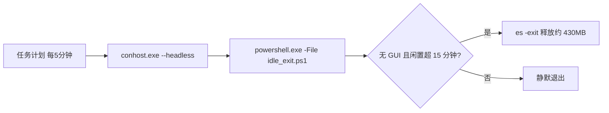

# Plan: sh-everything-search 闲置退出任务无窗口化（conhost --headless 注册 + 脚本化）

Plan for: "修复计划任务 sh-everything-idle-exit 每 5 分钟闪窗；注册方式改为 conhost --headless 并脚本化入库；修正技能收敛移动后的路径失效；同步更新技能文档"

## 问题陈述

计划任务 `sh-everything-idle-exit` 每 5 分钟在桌面闪现控制台窗口；用户持续观察数日后确认，禁用任务即消失。根因：`powershell.exe` 是控制台子系统程序，任务计划服务以无控制台方式拉起它时，conhost 在进程初始化最早期创建并绘制窗口——**早于** PowerShell 解析 `-WindowStyle Hidden`；该参数只能"先画后藏"，闪窗不可避免（Interactive 登录类型把窗口画在用户桌面）。

另发现：技能近日被 db9983c 收敛移动至 `sh-user-skills/sh-everything-search/` 后，任务动作引用的旧脚本路径已失效（Test-Path=False），README 第 27 行包装器示例路径同样过期，需一并修正。

## 需求（含用户决策）

1. **修复方式＝`conhost.exe --headless` 包装**（用户选 1=a）：从"创建即无窗口"层面根除闪窗；进程仍留在用户交互会话，`idle_exit.ps1` 依赖的「Everything GUI 窗口检测（MainWindowHandle）」与「es IPC 退出用户会话实例」语义保持不变。
   - 否决项：S4U（session 0 看不见用户桌面窗口、够不到用户会话 Everything IPC，语义破坏）；VBS 薄壳（微软弃用中，仅 headless 不可用时兜底）。
2. **任务注册脚本化落库**（用户选 2=a）：新增 `scripts/register_task.ps1`，幂等，可重装/换机一键注册。
3. **收尾验证后恢复启用**（用户选 3=a）：窗口事件钩子（SetWinEventHook）跨自然触发实测零窗口，通过即保留启用。
4. **文档与脚本同步更新**（用户追加要求："如果真的修复了，记得也更新一下那个 skill"）。

## 背景与调研

- 根因链（第一性原理）：console 窗口由 conhost 在应用代码执行前创建并绘制（OS 层）→ `-WindowStyle Hidden` 仅是启动后的"隐藏已有窗口" → Interactive（仅用户登录时运行）把窗口画在用户桌面 → 每 5 分钟闪一次。外部多来源证实为 Windows 长期已知行为；本机 Win11 25H2 已确认 `conhost --headless` 存在可用。
- 上轮误判教训：瞬态窗口用 20ms 轮询枚举会漏采（窗口存活仅几十毫秒），且从未覆盖"自然触发"、缺正对照；本次验证一律 `SetWinEventHook` 事件钩子 + 正对照。
- 任务现状（Export-ScheduledTask XML 实测，注册脚本需逐项复刻）：
  - Trigger：TimeTrigger + Repetition `PT5M`（无 Duration，无限重复）；
  - Settings：`Hidden=true`、`MultipleInstances=IgnoreNew`、`ExecutionTimeLimit=PT5M`、`StartWhenAvailable=true`、`DisallowStartIfOnBatteries=false`、`StopIfGoingOnBatteries=false`、`UseUnifiedSchedulingEngine=true`；
  - Principal：Interactive / Limited；Description=`Exit Everything after 15 min idle (sh-everything-search skill)`；
  - 动作（已失效）：`powershell.exe -NoProfile -ExecutionPolicy Bypass -WindowStyle Hidden -File "…\skills\sh-everything-search\scripts\idle_exit.ps1"`。
- 路径现状：脚本真实位置 `…\skills\sh-user-skills\sh-everything-search\scripts\idle_exit.ps1`（Test-Path=True）。
- 旧路径引用全仓扫描：仅 `README.md` 第 27 行一处需改（router 第 63/156 行仅含技能名；`.archived`、`docs` 无引用）。
- 提交环境：子仓 origin=`git@github.com:shihao-hub/td-agents-skills.git`（main）；`core.hooksPath=.githooks`（pre-commit 为国内密钥扫描）。仓库存在其它会话在途未提交文件（`.gitleaks.toml`、`.githooks/`、`.tests/`、`README-SECURITY.md`、`plans-05-*.md`、`secret_scanner.py`、`.archived/sh-edu-infographic/*`），本任务一律不碰、不暂存。

## 方案设计

新任务动作（由注册脚本以绝对路径生成）：

```
Execute   : C:\Windows\System32\conhost.exe
Arguments : --headless "C:\Windows\System32\WindowsPowerShell\v1.0\powershell.exe" -NoProfile -ExecutionPolicy Bypass -File "<skill>\scripts\idle_exit.ps1"
```

- `$PSScriptRoot` 推导 `idle_exit.ps1` 路径 → 技能目录再移动只需重跑注册脚本；
- 去掉已无意义的 `-WindowStyle Hidden`（headless 下无窗口可藏）。



- `register_task.ps1`：幂等（存在即先注销再注册）、默认注册为启用、支持 `-Unregister`；
- `verify_task_window.ps1`（Task 1 跑通版本整理入库）：WinEvent 钩子监听 N 秒，输出窗口事件（时间/类名/PID/进程/show→hide 时长）与汇总行；可捕获可见窗口作正对照；
- README 更新：示例路径修正；生命周期节写注册脚本用法与 headless 机制（警示勿再以 `-WindowStyle Hidden` 直注册）；环境事实追加根因一句与验证方法。

## 任务分解

- [ ] Task 1: 复现基线——临时探针任务 + 窗口事件钩子验证器
  - 文件：临时 `%TEMP%\opencode\win_event_watch.ps1`（不入库）；临时任务 `sh-everything-idle-exit-probe`（旧式动作，1 分钟无限重复，Interactive/Limited，Hidden）
  - 实现：写钩子验证器（后台消息泵 + 事件队列）；注册探针任务；监听 ≥4 分钟覆盖 ≥3 次触发；结束后注销探针任务
  - 验证：每次探针触发均伴随可见 console 类窗口事件（show→hide 毫秒级）；若 0 捕获则判定验证器失效，修复验证器后重试
  - Demo：窗口类名/进程/存活时长清单，钉死"旧注册方式必闪窗"

- [ ] Task 2: 编写注册脚本并重注册真实任务
  - 文件：`sh-user-skills/sh-everything-search/scripts/register_task.ps1`（新增）
  - 实现：按"背景与调研"逐项复刻 Trigger/Settings/Principal/Description；动作改为 conhost --headless + 新路径；幂等 + `-Unregister` 开关
  - 验证：注册后 XML 比对全部一致（动作/设置/触发器/身份）；`Test-Path` 动作引用路径=True；手动 Start-ScheduledTask 一次 → LastTaskResult=0
  - Demo：幂等重跑演示；任务恢复 Enabled

- [ ] Task 3: 钩子验证真实任务零窗口（跨自然触发）+ 验证器入库
  - 文件：`sh-user-skills/sh-everything-search/scripts/verify_task_window.ps1`（新增）
  - 实现：监听 ≥11 分钟覆盖 ≥2 次自然触发；期间开一个可见窗口作正对照
  - 验证：正对照被捕获；任务触发时段可见窗口事件=0；若出现闪窗 → 立即禁用任务并报告重规划
  - Demo：零窗口证据 + 正对照证据同屏呈现

- [ ] Task 4: 功能闭环——自然闲置 16 分钟后自动退出 Everything
  - 文件：（无新增；使用现有包装器与状态日志）
  - 实现：包装器冷启动 Everything（刷新 last_use）→ 保持 >15 分钟无查询（期间勿手动打开 Everything 窗口，否则按设计不退出）→ 等下一个 5 分钟触发
  - 验证：Everything 主实例退出（仅剩约 3MB 服务实例）；`%APPDATA%\language_projects\sh-everything-search\idle_exit.log` 新增 `idle N min -> exited` 行；LastTaskResult=0
  - Demo：退出日志 + 进程清单前后对比

- [ ] Task 5: 文档与注释更新，旧路径零残留
  - 文件：`sh-user-skills/sh-everything-search/README.md`、`sh-user-skills/sh-everything-search/scripts/idle_exit.ps1`
  - 实现：README 第 27 行示例路径改新位置；生命周期/环境事实改写（注册脚本用法、headless 机制、钩子验证方法）；`idle_exit.ps1` 头注释补充注册方式指引
  - 验证：grep 全仓旧路径 `skills/sh-everything-search` 0 命中（历史 plans 除外）；README 新命令实测可跑（如 register_task.ps1 幂等重跑）
  - Demo：文档呈现新机制，命令全部可直接执行

- [ ] Task 6: 提交与收尾
  - 文件：`.agents/skills`（子仓）+ 父仓子模块指针
  - 实现：子仓仅暂存本任务 4 个文件（register_task.ps1 / verify_task_window.ps1 / README.md / idle_exit.ps1）提交一笔并 push（plans-06 已于落盘时独立提交）；父仓仅暂存 `.agents/skills` 指针提交一笔并 push；勾选本计划全部任务、更新页脚；若本会话改动了父仓纳管文件，执行一次 `aoci_maintain` 对齐
  - 验证：提交范围隔离（无其它会话在途文件混入）；两仓 push 成功；最终任务状态一览
  - Demo：提交记录 + 任务状态

---
**最后更新：** 2026-10-10
**作者：** AI & User
**版本：** v1.0.0
