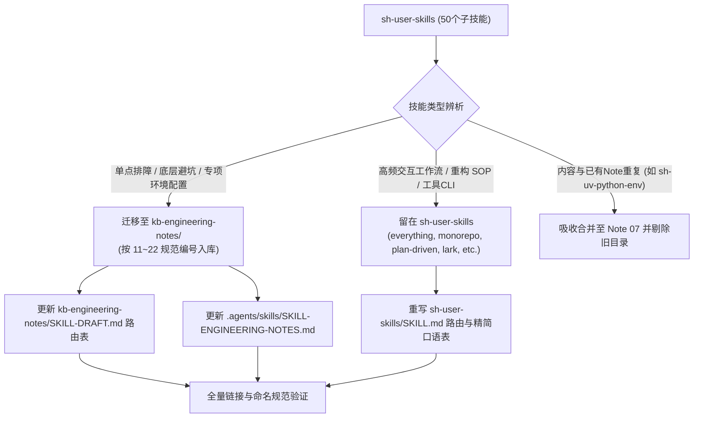

# Plan: sh-user-skills 重构与部分技能归流 kb-engineering-notes 实战手记知识库

📋 Plan for: "重构 sh-user-skills，将偏向单点排障、系统底层机制与环境配置的指南迁移至 kb-engineering-notes/，遵循两级渐进式感知架构，同步更新 SKILL-ENGINEERING-NOTES.md、kb-engineering-notes/SKILL-DRAFT.md 与 sh-user-skills 总路由。"

## 问题陈述
当前 `sh-user-skills` 聚合了多达 50 个子技能，涵盖装机环境、系统排障、开发重构、文档交接、检索归档五大域。
随着工程实战积累，其中许多属于典型的**单点问题排查、底层机制避坑与系统/IDE环境配置指南**（如 Windows 喇叭爆音、UWP 代理回环、Zed 日志诊断与子进程池堆积、Zed SQLite 会话找回、GLM 401 鉴权等）。
这些内容本质上是**硬核工程实战手记（Engineering Notes）**，更适合收纳在 `kb-engineering-notes/` 这一长期生长的避坑知识库中，遵循其两级渐进式感知架构（`SKILL-DRAFT.md` 索引 + `0N-*.md` 编号条目），避免 `sh-user-skills` 过于臃肿，同时让 `sh-user-skills` 聚焦于高频交互式 Agent 工作流与通用重构 SOP。

## 需求（含用户决策点）
1. **知识库规范对齐**：所有迁移至 `kb-engineering-notes/` 的文档必须严格遵循 `SKILL-ENGINEERING-NOTES.md`：
   - 采用自解释文件名：`0N-【目标工具+核心问题场景+解决目标】.md`（序号顺延已有 01~10）；
   - 符合 skill-creator 规范的 YAML frontmatter（`name: kb-<english-topic>`，`description` 包含功能与报错特征词，≤200字符）；
   - 规范四段论结构：一、现象与报错直击；二、底层根因剖析；三、标准解决与抢救 SOP；四、验证与防复发建议；
2. **两级感知元数据同步**：
   - 更新 `kb-engineering-notes/SKILL-DRAFT.md`（目录树与场景路由表）；
   - 更新 `SKILL-ENGINEERING-NOTES.md`（路由表、描述词与更新日期）；
3. **sh-user-skills 瘦身与总路由收敛**：
   - 物理清理已迁出的 `sh-user-skills/<skill-name>` 目录；
   - 更新 `sh-user-skills/SKILL.md`，从分类表与口语速查表中精简，建立清晰的指引（排障避坑类需求导流至 `skill-engineering-notes`）；
4. **重叠条目处理**：`sh-uv-python-env` 与已有 `07-uv统一全机Python环境与新电脑一键引导复现指南.md` 高度重叠，合并吸收后清理；
5. **计划先行与验证纪律**：计划先行落盘，获批后连续执行，完成后使用单测或命令全面检查文档链接与格式。

## 背景与现状调研
- `kb-engineering-notes/` 当前已有 10 篇实战手记（编号 01 至 10）：
  - 01: SublimeMerge 非相邻提交合并与重排
  - 02: Windows Git 变基 Permission denied 文件锁
  - 03: Git 变基 Rescheduled 队列挂起与冲突解析
  - 04: Cursor Markdown 独立标签页预览
  - 05: Cursor 免审批 YOLO 模式与沙箱网络
  - 06: Git Worktree 依赖复用与跨语言隔离权衡
  - 07: uv 统一全机 Python 环境与新机一键复现
  - 08: Windows Java/Maven 便携子目录与 Zed 任务调试
  - 09: Chrome 手动关闭窗口固定标签丢丢失与 SNSS 快照解析
  - 10: Antigravity CLI 粘图改键 Kitty 协议透传与 BOM 排障
- 待从 `sh-user-skills` 迁入 `kb-engineering-notes` 的第一批高价值排障与避坑候选（编号 11 起顺延）：
  - `sh-windows-audio-diagnose` -> `11-Windows声卡爆音无声与虚拟音频抢占排查指南.md` (`kb-windows-audio-diagnose`)
  - `sh-uwp-proxy-loopback` -> `12-Windows代理下微软商店与UWP回环网络豁免排障指南.md` (`kb-uwp-proxy-loopback`)
  - `sh-windows-memory-guard` -> `13-Windows内存防死机与Pagefile提交内存归因优化指南.md` (`kb-windows-memory-guard`)
  - `sh-opencode-glm-auth` -> `14-opencode连接GLM模型401鉴权失败与端点排障指南.md` (`kb-opencode-glm-auth`)
  - `sh-zed-lsp-install` -> `15-Zed语言服务器下载失败文件重命名占用与杀毒竞态排障指南.md` (`kb-zed-lsp-install`)
  - `sh-zed-acp-agent-env` -> `16-Zed与IDEA外接ACP代理环境失效与子进程池累积排查指南.md` (`kb-zed-acp-agent-env`)
  - `sh-zed-agent-triage` -> `17-Zed面板InternalError会话中断与ACP线程锁竞态归因指南.md` (`kb-zed-agent-triage`)
  - `sh-zed-session-db` -> `18-Zed会话丢失提取与SQLite数据库表解析抢救指南.md` (`kb-zed-session-db`)
  - `sh-github-coexist` -> `19-多Git账号GitHub与GitLab共存及SSHIncludeIf配置指南.md` (`kb-github-gitlab-coexist`)
  - `sh-atuin-pwsh-history` -> `20-Windows终端Atuin命令历史同步与PwshProfile排障指南.md` (`kb-atuin-pwsh-history`)
  - `sh-cc-switch-db` -> `21-cc-switch配置SQLite直接读写与跨应用模型迁移指南.md` (`kb-cc-switch-db`)
  - `sh-vscode-fork-ext-port` -> `22-VSCode扩展跨分支IDE手动搬运与注册生效指南.md` (`kb-vscode-ext-port`)

## 方案设计

## 任务分解

- [ ] Task 1: 提炼转换系统与排障类技能至 kb-engineering-notes 条目（11 至 14）
  - 文件：`kb-engineering-notes/11-Windows声卡爆音无声与虚拟音频抢占排查指南.md`, `kb-engineering-notes/12-Windows代理下微软商店与UWP回环网络豁免排障指南.md`, `kb-engineering-notes/13-Windows内存防死机与Pagefile提交内存归因优化指南.md`, `kb-engineering-notes/14-opencode连接GLM模型401鉴权失败与端点排障指南.md`
  - 实现：读取原 `sh-user-skills` 对应 README.md，按照四段论规范重写为自包含的 Note 格式，补充 frontmatter（`name: kb-*`，精准 description）。
  - 验证：文件结构符合 frontmatter 规范，行数合理无冗余，编码为 UTF-8 无 BOM。
  - Demo：各文档包含完整的现象直击、底层机理解析与抢救 SOP。

- [ ] Task 2: 提炼转换 Zed 与编辑器专项排障技能至 kb-engineering-notes 条目（15 至 18）
  - 文件：`kb-engineering-notes/15-Zed语言服务器下载失败文件重命名占用与杀毒竞态排障指南.md`, `kb-engineering-notes/16-Zed与IDEA外接ACP代理环境失效与子进程池累积排查指南.md`, `kb-engineering-notes/17-Zed面板InternalError会话中断与ACP线程锁竞态归因指南.md`, `kb-engineering-notes/18-Zed会话丢失提取与SQLite数据库表解析抢救指南.md`
  - 实现：读取对应原技能，整合日志诊断路径（telemetry.log、Zed.log）、SQLite 查询命令与子进程池诊断。
  - 验证：涉及的 PowerShell 探测脚本与 SQLite 语句完整准确。
  - Demo：提供从进程排查到 SQLite 抢救的闭环 SOP。

- [ ] Task 3: 提炼转换工具链与跨环境配置技能至 kb-engineering-notes 条目（19 至 22）
  - 文件：`kb-engineering-notes/19-多Git账号GitHub与GitLab共存及SSHIncludeIf配置指南.md`, `kb-engineering-notes/20-Windows终端Atuin命令历史同步与PwshProfile排障指南.md`, `kb-engineering-notes/21-cc-switch配置SQLite直接读写与跨应用模型迁移指南.md`, `kb-engineering-notes/22-VSCode扩展跨分支IDE手动搬运与注册生效指南.md`
  - 实现：将多账号 SSH/gitconfig 隔离、Atuin profile 报错修复、cc-switch 数据库操作与 VS Code 插件搬运迁移为标准实战手记。
  - 验证：路径变量无硬编码失效，配置命令直接可运行。
  - Demo：条目 19~22 全部就绪。

- [ ] Task 4: 整合重复技能 sh-uv-python-env 并安全物理清理 sh-user-skills 已迁出目录
  - 文件：`kb-engineering-notes/07-uv统一全机Python环境与新电脑一键引导复现指南.md`, `sh-user-skills/`
  - 实现：检查 `sh-user-skills/sh-uv-python-env/README.md`，将其中特有的全局 venv 补丁与卸载细节并入 Note 07；在 `sh-user-skills` 中安全删除已迁移的 13 个子目录。
  - 验证：运行 `Get-ChildItem sh-user-skills` 确认目标目录已被移除，其余开发与工具技能完整留存。
  - Demo：`sh-user-skills` 目录结构大幅瘦身。

- [ ] Task 5: 同步更新知识库总纲与路由表
  - 文件：`.agents/skills/SKILL-ENGINEERING-NOTES.md`, `kb-engineering-notes/SKILL-DRAFT.md`
  - 实现：在两个文件中同步增补 11 至 22 号新条目（含自解释文件名、核心场景、识别关键词），更新 `SKILL-DRAFT.md` 的目录架构树，更新 `SKILL-ENGINEERING-NOTES.md` 的 description 关键词与最后更新日期。
  - 验证：检查两处路由表条目数量一致（共 22 条），所有 file:// 链接指向真实存在的文件。
  - Demo：知识库总纲清晰呈现 01~22 全量索引。

- [ ] Task 6: 重构 sh-user-skills 总入口与分流器
  - 文件：`sh-user-skills/SKILL.md`
  - 实现：根据迁移结果全面重写 `sh-user-skills/SKILL.md` 的 frontmatter description、分类表格与口语速查表；将系统排障类诉求明确分流导向 `skill-engineering-notes`（或对应 Note）；精简总控体积，突出高频业务能力。
  - 验证：运行 Python 脚本校验 markdown 内的所有相对/绝对路径与分类表的一致性。
  - Demo：`sh-user-skills` 成为清晰敏捷的业务与工作流总入口。

---
**最后更新：** 2026-10-10  
**作者：** AI & User  
**版本：** v1.0.0
