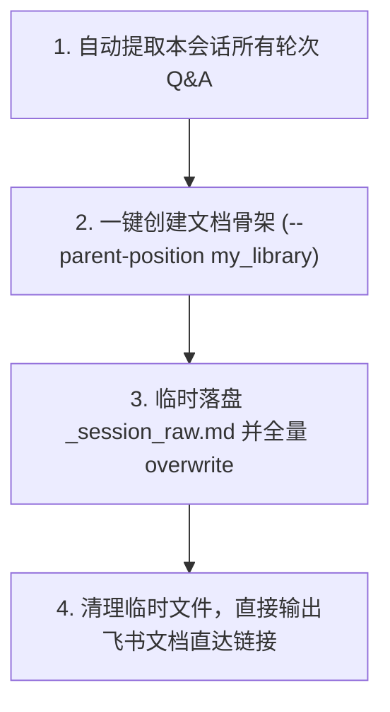

# 会话完整归档至飞书云文档（sh-lark-session-doc）

> **CRITICAL（执行纪律）**：
> 1. **二话不说，立即执行**：当用户点名本 skill 或要求导出/归档当前会话时，**禁止向用户反问或反复确认**，直接按 SOP 静默执行全流程，最后只交付文档链接。
> 2. **一字不差原封不动（Verbatim）**：**严禁做任何总结、摘要、二次提炼或结构删减**！必须把每一轮的 User 提问与 Assistant 回答（含代码块、表格、长文本）原样写入。
> 3. **存入个人文档库**：创建时必须带 `--parent-position my_library`，身份必须 `--as user`。

---

## 自动化四步工作流（Zero-friction SOP）



### 第 1 步：整理完整会话为 Markdown

将当前会话从第 1 轮到最新一轮的全部内容拼装为 Markdown 格式（严禁省略任何一轮）：

```markdown
# [当前讨论主题/标题]（完整会话记录）

---

## 轮次 1

### 👤 用户 (User)
> [第1轮用户原始输入]

### 🤖 助手 (Assistant)
[第1轮助手原始完整回复]

---

## 轮次 2

### 👤 用户 (User)
> [第2轮用户原始输入]

### 🤖 助手 (Assistant)
[第2轮助手原始完整回复]
```

### 第 2 步：创建个人文档库文档（获取 token）

在终端直接执行（注意替换 `<文档标题>`）：

```powershell
lark-cli docs +create --as user --parent-position my_library --title "<文档标题>" --doc-format markdown --content "# 初始化中..."
```

从返回的 JSON 结果中读取 `data.document.document_id`。

### 第 3 步：两阶段防转义覆写（核心稳健机制）

为防止长文本、Markdown 代码块与引号在命令行传参中被破坏，统一通过本地临时文件传参：

1. 在当前工作目录下将第 1 步整理的完整 Markdown 写入临时文件 `_session_raw.md`。
2. 运行覆写命令：
   ```powershell
   lark-cli docs +update --as user --doc "<document_id>" --command overwrite --doc-format markdown --content "@./_session_raw.md"
   ```
3. 立即清理临时文件：
   ```powershell
   Remove-Item -Path ".\_session_raw.md" -Force
   ```

### 第 4 步：直接交付结果

执行完毕后直接向用户输出：
- 飞书文档标题
- 飞书云文档直达链接：`https://<租户域名>.feishu.cn/docx/<document_id>`
- 归档完成状态（如：“已原封不动将全部 N 轮对话归档至个人文档库”）。
