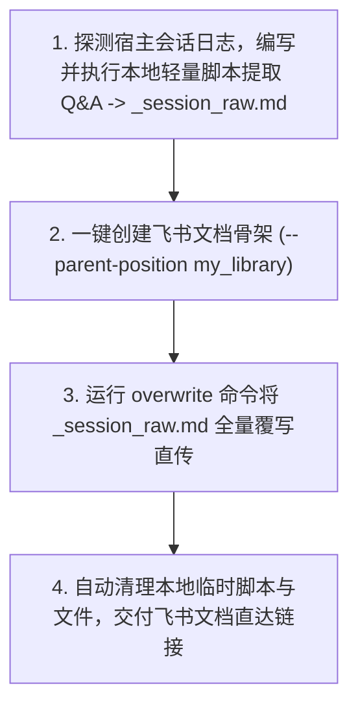

---
name: sh-lark-session-doc
description: 用户提到把当前会话/对话导出或归档为飞书云文档时使用，直接原封不动存入个人文档库；非导出当前会话或要导出本地已有文件时不使用
---

# 会话完整归档至飞书云文档（sh-lark-session-doc）

> **CRITICAL（执行纪律与核心原则）**：
> 1. **二话不说，立即执行**：当用户点名本 skill 或要求导出/归档当前会话时，**禁止向用户反问或反复确认**，直接按 SOP 静默执行全流程，最后只交付文档链接。
> 2. **一字不差原封不动（Verbatim）**：**严禁做任何总结、摘要、二次提炼或结构删减**！必须把每一轮的 User 提问与 Assistant 回答（含代码块、表格、长文本）原样写入。
> 3. **零 Token 损耗与本地直传原则（Zero-Token Cost via Local Scripting）**：
>    - **严禁**让 LLM 在生成窗口中一段一段打字吐出几万字长文本，这会严重消耗 Token 并触发最大生成长度截断。
>    - **必须**编写并执行简短的本地脚本（Python/Node/Shell 等），**直接读取当前 Agent 宿主环境落盘的会话文件（Transcript/History 日志）**，在本地完成 Markdown 格式拼装并输出为 `_session_raw.md`，然后通过 `lark-cli` 批量直传。
> 4. **存入个人文档库**：创建时必须带 `--parent-position my_library`，身份必须 `--as user`。

---

## 自动化四步工作流（Zero-friction SOP）



### 第 1 步：定位会话日志并写脚本输出 `_session_raw.md`

不同 Agent 宿主环境的会话日志通常由平台底层直接落盘。Agent 应当自适应定位当前环境的记录文件：

- **Antigravity (AGY)**: 位于 `<appDataDir>\brain\<conversation-id>\.system_generated\logs\transcript_full.jsonl`（或 `transcript.jsonl`）。
- **Claude Code**: 位于 `~/.claude/projects/.../` 下的会话 JSON 或转储记录。
- **Codex / OpenCode**: 位于对应 session 缓存目录或 state jsonl。

#### 本地脚本处理范式（以 Python 为例）

编写临时处理脚本，流式解析会话日志中的 `USER_INPUT` 与 `PLANNER_RESPONSE`（或 `user` / `assistant`），拼装为规范的 Markdown：

```markdown
# [当前讨论主题/标题]（完整会话记录）

---

## 轮次 1

### 👤 用户 (User)
> [第1轮用户原始输入]

### 🤖 助手 (Assistant)
[第1轮助手原始完整回复]

---

## 轮次 2

### 👤 用户 (User)
> [第2轮用户原始输入]

### 🤖 助手 (Assistant)
[第2轮助手原始完整回复]
```

**关键输出目标**：在当前工作目录下生成物理文件 `_session_raw.md`（完全在本地 CPU 与磁盘间完成，不消耗模型生成 Token）。

---

### 第 2 步：创建个人文档库文档（获取 token）

在终端直接执行（注意替换 `<文档标题>`）：

```powershell
lark-cli docs +create --as user --parent-position my_library --title "<文档标题>" --doc-format markdown --content "# 初始化中..."
```

从返回的 JSON 结果中读取 `data.document.document_id`。

---

### 第 3 步：两阶段防转义覆写（核心稳健机制）

为防止长文本、Markdown 代码块与引号在命令行传参中被破坏，统一通过本地临时文件传参：

1. 确认第 1 步生成的临时文件 `_session_raw.md` 存在且非空。
2. 运行覆写命令（利用 `@` 文件引用语法直接二进制流式推送）：
   ```powershell
   lark-cli docs +update --as user --doc "<document_id>" --command overwrite --doc-format markdown --content "@./_session_raw.md"
   ```
3. 立即清理临时文件与临时处理脚本：
   ```powershell
   Remove-Item -Path ".\_session_raw.md" -Force -ErrorAction SilentlyContinue
   ```

---

### 第 4 步：直接交付结果

执行完毕后直接向用户输出：
- 飞书文档标题
- 飞书云文档直达链接：`https://<租户域名>.feishu.cn/docx/<document_id>`
- 归档完成状态（如：“已通过本地流式脚本将全部 N 轮对话原封不动归档至个人文档库”）。