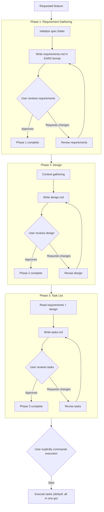

# Spec-Driven Development

用 spec 在写代码之前规划功能。spec 是一份**可直接实施**的文档，覆盖需求、设计和任务；它绝不是"一份关于如何写 spec 的计划"。

本工作流产出三个文件，存放在 `specs/{NN}-{feature_name}/` 下（编号规则与 `specs/` 的具体位置见 Phase 1 Step 1）：

- `requirements.md` — 功能**做什么**（EARS 格式）
- `design.md` — **如何**实现
- `tasks.md` — 按顺序排列的实施步骤

三个阶段严格按顺序进行，每个阶段结束时都有一个明确的用户批准关卡。这样做的原因：在文档阶段纠正一个错误只花几分钟，同样的错误留到代码阶段要花几小时。在用户明确批准当前阶段之前，绝不开始下一阶段——含糊或没有回应都不算批准，必须追问确认。

**硬性关卡**：三份文档全部完成并获批准后，必须停下——执行 tasks.md 只能由用户明确下达指令启动（如"开始执行"、"执行任务清单"）。批准文档本身**不构成执行授权**，绝不能在用户未下令前自动开始执行任何任务。

## Write permission check

本工作流从 Phase 1 创建第一个 spec 文件起就需要写文件权限，执行阶段还要写代码文件。在开始创建任何一个文件之前，先确认当前模式允许写入：

- 如果当前处于只读/计划等不允许写文件的模式，或写入被环境拒绝：**不要**把文件内容直接贴在对话里充数，也**不要**静默跳过或反复重试失败——立即停下，明确告诉用户当前模式不允许写入文件，请先切换到可写入的模式。提示时按用户实际使用的工具来说（如"请退出计划模式"、"请切换到正常执行模式"或"请授予写权限"）
- 用户切换模式后，从被中断的那一步继续，已完成的步骤不需要重来

## Workflow



## Phase 1: Create Feature Requirements

### Step 1: Initialize the spec folder

创建 `specs/{NN}-{feature_name}/`。`{NN}` 是数字前缀（见下方编号规则），`{feature_name}` 是功能名的英文单词小写、以 `-` 分割（如 `user-auth`；用户用中文描述功能时，由你拟对应的英文短词）。例如做电商功能时初始化为：

```
specs/01-ecommerce/
```

`specs/` 放在哪里（落位前必须先看现场——先扫项目结构，禁止不看结构直接取默认）：按三步判定——① 项目或用户已声明"文字类产物归 `docs/`"的约定（写在 AGENTS.md/README 里，或用户在对话中明说）→ `docs/specs/`；② 项目已有 `docs/` → 判其语义：**项目文档中心**（收纳说明、手册、计划等文字产物）→ `docs/specs/`，**知识参考库**（学习笔记、外部资料）→ 项目根 `specs/`；③ 语义判不清 → 问用户一句再落位，不自行默认。唯一固定的是层级结构——三份文件必须位于同一个 `specs/{NN}-{feature_name}/` 目录下，且同一项目的所有功能 spec 始终放在同一个 `specs/` 下。

#### Directory numbering rules

- **取号**：扫描 `specs/` 下所有子目录，提取形如 `^\d+-` 的数字前缀，取最大编号 +1；`specs/` 为空或不存在时从 `01` 开始。无数字前缀的旧目录（如 `specs/ecommerce/`）忽略、不参与计算、保留原样不改名
- **零填充**：个位数补零（`01`–`09`），`10`–`99` 为两位，超过 99 自然进位为三位（`100+`）
- **同号冲突**：目标编号已被占用时，顺延取下一个未被占用的编号
- **99 上限**：新编号将达到 `100` 及以上时，先向用户提示"specs 数量已达到 99 个，超出设定上限"；用户仍要求创建则照常 +1 继续——提示仅作告知，不阻断
- 编号在 `specs/` 的所有子目录之间全局递增，一个项目一个序列
- 从已有 spec 继续工作时按原目录名定位，编号规则只作用于新建 spec

### Step 2: Gather requirements in EARS format

- 查看用户提供的所有文件、链接和说明；功能涉及现有代码时，先浏览相关代码
- 明确范围、边界和约束。需求有歧义时向用户提问澄清，不要默默替用户发明需求
- 每条需求都必须使用 EARS（Easy Approach to Requirements Syntax）格式，见下文
- 用户只给了部分需求时，基于上下文补全其余部分，并明确标注哪些是假设

### Step 3: Write requirements.md

使用下面这个模板：

```
# Requirements Document

## Introduction
[Provide a brief overview of the feature request and the current state of the project]

## Requirements

### Requirement 1
[Detailed description with acceptance criteria]

#### Scenario 1
[Description]
- **WHEN** [event]
- **THE SYSTEM SHALL** [expected behavior]

### Requirement 2
...
```

编号规则：需求按 `REQ-1`、`REQ-2`… 顺序编号，标题写作 `### Requirement N`，其他文档（design.md、tasks.md）引用时统一使用 `REQ-N`。

判断需求是否合格的标准：可验证。如果你写不出对应的 WHEN / SHALL 场景，它还不是一条需求。

### Approval loop

将 requirements.md 呈现给用户，明确询问：**批准，还是需要修改**。根据反馈修订后重新呈现，如此往复，直到用户明确批准。批准后才进入 Phase 2。

修订纪律：**修订前必须先读当前 requirements.md 全文**，在现有内容基础上修改，绝不从零重写——用户的批注与手改一经确认就是 ground truth，覆盖它们等于销毁已达成的事实基准。

### EARS format

EARS 用五种固定的句子结构消除需求歧义，让每条需求都能直接转化为测试用例和任务引用：

| Type | Format | Example |
|------|--------|---------|
| Ubiquitous | The [system] shall [action] | The system shall authenticate users via JWT tokens |
| Event-driven | When [event] the [system] shall [action] | When the user submits the login form, the system shall validate credentials |
| State-driven | While [state] the [system] shall [action] | While the account is locked, the system shall deny login attempts |
| Optional feature | Where [feature] is included the [system] shall [action] | Where dark mode is included, the system shall persist theme preference |
| Unwanted behavior | If [condition] then the [system] shall [action] | If the token is expired, the system shall redirect to the login page |

## Phase 2: Create Feature Design Document

### Step 1: Context gathering

- 阅读已批准的 requirements.md
- 浏览项目结构和现有模式、正在使用的库——设计要贴合这个项目，而不是一份通用设计
- 在确定技术方案前，与用户澄清技术约束（性能要求、平台限制、依赖偏好）

### Step 2: Write design.md

使用下面这个模板：

```
# Design Document

## Overview
[Provide a high-level overview of the feature and this document]

## Context
[Explain the background, current state, and motivation for the feature. Include a mermaid visualization if applicable]

## Goals and Non-Goals
- Goals:
    - [List the specific objectives of the feature]
- Non-Goals:
    - [List what is explicitly out of scope for this feature]

## Detailed Design

### {Main feature name}
- [ ] # `ADDED|CREATED|UPDATED` [file or component path or module]
    - **Purpose** [purpose of the change]
    - **Changes** [specific changes to be made]
    - **Complexity** [Low|Medium|High]

### Module Collaboration and Data Flow

[Explain how the modules/components above are organized and composed at runtime — the reader must understand not only what each file does, but how they are wired together and work as a system. Cover at least:

- Static dependency direction: who imports whom, where dependency injection decouples components (a mermaid dependency diagram is recommended)
- Startup/assembly sequence: how the entry point wires the components together, step by step
- Key runtime data flows: end-to-end call chains of the core scenarios (request paths, background loops)
- Concurrency model: shared state, its protection mechanism, and who writes vs who reads]

### Functional Requirements Table

<list of feature requirements from the feature spec>

| Requirement ID | Requirement | Design Component |
|----------------|-------------|------------------|
| REQ-1          | ...         | ...              |

### Action checklist

- [ ] Action 1
- [ ] Action 2
- [ ] Action 3
```

要点：

- 在 Detailed Design 中，为每个变更条目标注变更类型标签：`CREATED`（新建文件）、`UPDATED`（修改现有文件）、`ADDED`（新增组件/模块，视同 CREATED）。这告诉执行者：所有标记为新建的文件在任务阶段都必须真实创建
- Detailed Design 不能只是文件卡片清单：文件卡片回答「每个文件做什么」，「Module Collaboration and Data Flow」小节回答「它们如何被拼装与协作」（依赖方向、组装顺序、数据流、并发模型）。只有卡片没有协作说明的 design.md 不合格——读者看完仍不知道如何组织实现
- Functional Requirements Table 把 design.md 和 requirements.md 对应起来：需求文档里的每一条需求都要出现在表中，并映射到具体的设计组件
- Action checklist 将相关工作按设计组件分组并标注需求 ID——它是粗粒度的"要做什么"；tasks.md 才是细粒度、有顺序、可直接执行的任务分解，两者不要混淆
- 可选深化：当功能包含核心不变量（输入-输出必须恒成立的关系）时，在 Detailed Design 中为每条不变量写一句**正确性属性**（形如"对任意合法输入 X，系统应始终满足 Y"），供测试阶段做基于属性的验证——概念引导即可，不强制，也不引入额外工具链
- 文档较长时先输出一行进度（如"正在生成 design.md…"）再动笔，避免长时间静默

### Caution

- 不要把代码写入项目的实际文件——这是设计文档，不是实现
- 聚焦高层结构，配以简短示例；不要实现真实功能
- 可以有代码示例来澄清意图，但示例不等于实现

### Approval loop

将 design.md 呈现给用户，明确询问：**批准，还是需要修改**。修订并重新呈现，直到用户明确批准。批准后才进入 Phase 3。

修订纪律：**修订前必须先读当前 design.md 全文**，在现有内容基础上修改，绝不从零重写；与已批准的 requirements.md 冲突时，以 requirements.md 为准。

## Phase 3: Create Task List

### Step 1: Read requirements.md and design.md

写任务前必须先读完这两份文档。tasks.md 中的每个任务都要能追溯到需求或设计。

### Step 2: Write tasks.md

遵循这个结构：

```
# Task List

- [ ] 1. [Task description with complete implementation details]
  - Sub-task description
  - Run and validate: [command]
  - Ref: [req-ID]
```

只有顶层任务带 checkbox——它是进度跟踪的单位；子项用普通列表描述细节。每个任务必须：

- 使用 checkbox 格式：`- [ ] 1. Task description`
- 包含完整的实施细节——任务是自包含的，读任务本身就能动手，不需要回头猜
- 引用确切的文件路径
- 指明确切的依赖包及版本（例如 `zod@3.23.8`）
- 包含该任务的运行/验证命令
- 用 `[Ref: req-ID]` 标注它实现的是哪条需求

测试类任务（编写单元测试、集成测试、测试脚本、测试用例等）在任务描述末尾额外标注 `[test]` 标签，例如：`- [ ] 5. Create unit tests for storage module [test]`——执行阶段靠这个标签识别并默认跳过它们。

任务清单较长时先输出一行进度（如"正在生成 tasks.md…"）再动笔，避免长时间静默。

示例（格式良好的任务）：

```
- [ ] 4. Create settings module
  - Create src/lib/settings.ts
  - Add `settings` export
  - Add validation logic using zod@3.23.8
  - Run and validate: `npm run build`
  - Ref: REQ-1, REQ-2
```

### Approval loop

将 tasks.md 呈现给用户，明确询问：**批准，还是需要修改**。修订并重新呈现，直到用户明确批准。

修订纪律：**修订前必须先读当前 tasks.md 全文**，在现有内容基础上修改，绝不从零重写；与已批准的 requirements.md / design.md 冲突时，以后者为准。

tasks.md 获批即三份文档全部就绪，此时必须停下：明确告知用户"三份 spec 文档已完成"，然后**等待用户的执行指令**——批准文档不等于授权执行，在用户明确说"开始执行"之类指令之前，不要执行任何任务。停下时附带一行选项方便用户下令：`[OPTIONS: 开始执行全部任务 | 逐任务执行 | 暂不执行]`——选项只是指令入口，用户选中之前不执行任何任务。

## Executing the tasks

**进入执行模式的唯一途径：用户在三个文件完成后明确下达执行指令**（如"开始执行"、"执行任务清单"）。批准 tasks.md 文档本身不是执行指令，绝不能在用户审查前或未下令时自动开始执行。收到执行指令后，遵守以下通用规则：

- 动手前先读 requirements.md、design.md 和 tasks.md 三份文件
- 按任务编号顺序执行
- 完成的任务在 tasks.md 中标记为 `[x]`；如有偏差或新发现，在已完成任务下追加实施说明

### 默认方式：一口气执行

**默认从任务 1 连续执行到最后一个任务，中途不暂停等用户审查，也不做任何测试相关工作**：

- 跳过所有带 `[test]` 标签的任务：不写任何测试代码，这些任务保持 `[ ]` 未勾选状态
- 跳过任务里记录的 Run and validate 命令（它们是备用信息）

全部完成后一次性向用户汇报：做了什么、跳过了哪些 `[test]` 任务、有哪些偏差、最终状态。

### 用户明确指定时才改变节奏

仅当用户明确提出时，才切换为以下方式（两者可独立指定）：

- **逐任务执行**（用户说"一个一个执行"、"逐步执行"、"每做完一个停下来"等）：一次只执行一个任务，完成后停下来等用户审查确认，确认后才继续下一个
- **执行测试**（用户说"执行测试"、"写测试"、"跑验证"、"每个任务要验证"等）：补做之前跳过的 `[test]` 任务，并按 tasks.md 中记录的 run/validate 命令逐任务验证后再继续

用户没有明说时，一律按默认方式执行：不要主动停下来问、不要主动跑测试，也不要主动写测试。

## Document writing rules

- 所有 spec 文档使用与用户请求相同的自然语言书写；EARS 关键词（WHEN / IF / THEN / THE SYSTEM SHALL / WHERE / WHILE）保留英文原文，便于识别和追溯
- 文档文件内只有内容本身——不写开场白和结束语
- 三份文档各司其职：requirements.md 说 WHAT，design.md 说 HOW，tasks.md 说 ORDER

## Troubleshooting

| Issue | Solution |
|-------|----------|
| Requirements not in EARS format | Rewrite in EARS |
| Design is a flat list of file cards without organization | Add the "Module Collaboration and Data Flow" section: dependency direction, assembly sequence, key data flows, concurrency model |
| Tasks not granular enough | Break into smaller, atomic steps |
| Spec files not in correct structure | Reorganize under specs/{NN}-{feature_name}/ |
| Approval not requested between phases | Explicitly ask the user to approve before proceeding to the next phase |
| File writes blocked by current mode | Tell the user the current mode disallows writing files, ask them to switch to a writable mode, then resume from the interrupted step |
| Stopped during task execution | Ensure each task is fully completed before marking it as complete |
| Regeneration overwrote manual edits | Read the current file in full before revising; treat confirmed content as ground truth |

---

**最后更新：** 2026-09-21
**版本：** v1.1.0

## 变更记录

| 版本 | 日期 | 说明 |
|---|---|---|
| 1.1.0 | 2026-09-21 | 引入版本管理（此前无版本记录，初版视为 v1.0.0）。并入生产级 spec 工作流机制（已去产品化）：三个 approval loop 均新增修订纪律（修订前必读当前文件、绝不从零重写、已确认内容为 ground truth、与上游文档冲突时以上游为准）；tasks.md 完成后的停止点附带执行选项行 `[OPTIONS: 开始执行全部任务 | 逐任务执行 | 暂不执行]`（不改变"批准≠执行授权"硬性关卡）；design.md 要点新增"可选深化：正确性属性"与文档生成进度提示；Troubleshooting 新增"再生成覆盖手改"条目。specs/{NN}-{feature_name}/ 三文档目录与编号约定维持不变 |
