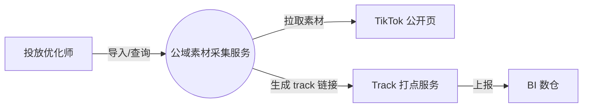
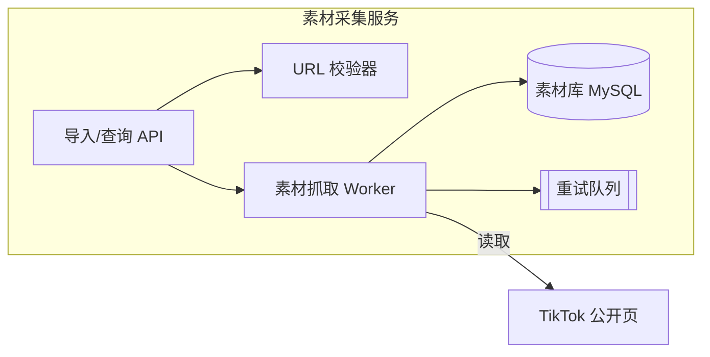

# 技术方案文档（Design Doc）——最重要的文档类型

业内两个标杆的融合：**Google Design Doc**（Malte Ubl 的结构：Context / Goals & Non-Goals / Design / Alternatives / 横切关注点）+ **国内大厂评审模板**（腾讯八大模块：现状 / 需求 / 方案描述 / 线上方案 / 部署拓扑 / 风险评估 / 阶段规划 / 工作量评估）。

## 推荐骨架（融合版）

```
# XX 技术方案
0. 文档信息：作者 / 评审人 / 状态（草稿·评审中·已定稿）/ 变更记录
1. 背景与目标
   1.1 Context：现状 + 技术背景。只写客观事实，细节放链接，保持简短
   1.2 Goals：可衡量的目标（做什么、做到什么程度）
   1.3 Non-Goals：明确不做的事——「看起来该做但我们选择不做」，
       这是防止范围蔓延和读者误会的关键章节
2. 总体设计
   2.1 链路架构图（C1 系统上下文图 + C2 容器图，见下）
   2.2 核心流程（关键场景的时序 / 流程描述）
   2.3 模块划分与职责（每个模块一句话职责）
3. 关键设计决策 ⭐ 方案的灵魂
   每个决策一节：背景 → 备选方案（对比表）→ 选择理由 → 代价
4. 数据设计
   关键表 DDL / 关系说明 / 量级估算 / 索引依据（对应哪些查询）
5. 接口设计（下游对接清单）
   每个接口：路径 / 方法 / 参数 / 响应 / 错误码 / 调用方
   变更类接口加幂等性说明
6. 异常与边界
   异常场景清单 / 降级预案 / 灰度计划 / 回滚方案 / 监控告警
7. 排期与里程碑（骨架见 references/05-schedule-milestones.md）
8. 风险与待确认
附录：术语表、参考资料链接
```

## 评审人最优先看的四核心

一份技术方案，评审人和下游最先找的四样东西，必须显眼、完整：

| 四核心 | 对应章节 | 要点 |
|--------|---------|------|
| **链路架构** | 2.1 | C1/C2 图，一屏一张，图例统一 |
| **设计目的和思路** | 3 | 备选方案对比 + 取舍理由（ADR 式） |
| **表结构设计** | 4 | 关键表 + 关系 + 量级 |
| **下游接口清单** | 5 | 契约 + 错误码 + 调用方 |

**反模式警告**：推理过程（「我们先考虑 A，然后排除……」）不能出现在正文；但备选方案和取舍结论**必须**出现。推理是过程，权衡是结论。

## 写作要点（来自 Google 实践）

- **系统上下文图**让读者用熟悉的环境定位新系统——这是读者建立心智模型的第一步。
- **API 只画与权衡相关的草图**，不复制完整接口定义（冗长、含无用细节、易过时），完整契约放链接。
- **数据存储**讲形式和理由（为什么这张表放这个库、为什么这个量级要分表）。
- **代码 / 伪代码**：除非描述新颖算法，否则不出现；可以链接原型代码。
- **横切关注点**：安全、隐私、可观测性、监控——每类系统都该有自己的标准清单，方案里逐一过。
- **篇幅**：大型方案甜点区 10–20 页；增量改动写 1–3 页迷你设计文档（Context + 设计 + 备选 三节即可）；明显超长就拆子问题。

## 值不值得写方案文档？5 个判断问题（≥3 个「是」就写）

1. 是否不确定正确设计，值得花前期时间换取确定性？
2. 是否需要无法逐一 review 代码的资深工程师参与设计？
3. 设计是否模糊或有争议，达成组织共识有价值？
4. 团队是否容易忘记安全、日志、容量这类横切关注点？
5. 是否需要给遗留系统留下高层设计洞察？

## 文档生命周期（写完不是结束）

1. **写**：先和最懂问题的一两个人小范围迭代出稳定版，再扩大范围。
2. **评审**：从轻量（评论区讨论）到重量级（正式评审会）。评审的目的是早期发现问题，此时改动成本最低——不要为了等排期会而阻塞关键反馈。
3. **实现**：计划与实现冲突时回写文档；系统未上线前一定要更新。
4. **维护**：大变更用「修正案」模式（改动写成新文档，从原文链接过去）；1–2 年后重读自己的文档，复盘对错。

## mermaid 模板（飞书原生支持，直接改用）

C1 系统上下文图：



C2 容器图（服务内部视图）：



画图纪律：一张图一屏内放得下；每张图有图例；框线不超过 12 个，超了就分层（先 C1 再 C2）。
